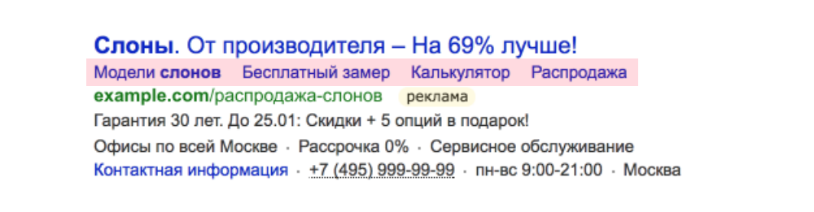
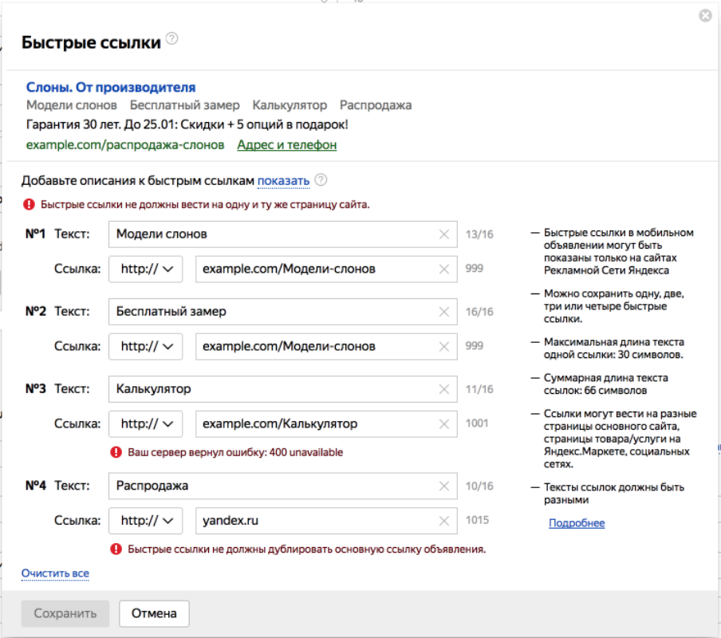
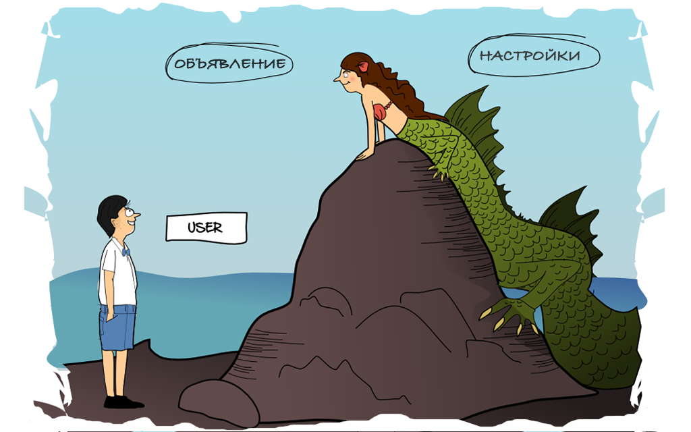
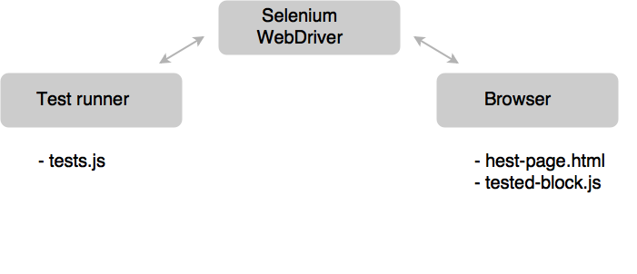

---

layout: yandex2

style: |
    /* собственные стили можно писать здесь!! */
    
    .selenium { width: 1200px; margin: 0 auto;}
    .adv-direct { width: 1000px; margin: 0 auto;}
    .adv-preview2 { width: 1200px; margin: 0 auto;}
    .headless { width: 1000px; margin: 0 auto;}    
    
    

---

# {:.logo}

## {{ site.presentation.title }}
{:.title}

### {{ site.presentation.service }}



{:.nda}


<div class="authors">

<p>{{ site.author.name }}, {{ site.author.position }}</p>



<p>{{ site.author2.name }}, {{ site.author2.position }}</p>


</div>

## Почему мы пишем тесты?
{:.section}

## Директ - очень большой проект

- {:.next}большая команда
- {:.next}сложная предметная область

## Пример объявления
{:.images}

{:.adv-preview2}

## Настройки объявления
{:.images}

{:.adv-direct}

## Заголовок будет скрыт
{:.fullscreen}



## Selenium-тесты
{:.section}

## Как это работает?

{:.selenium}

## Достоинства

- одинаковый API для разных браузеров
- масштабируемость

## Только интеграционные тесты!
{:.blockquote}

## Отличия тестов

- модульные тесты изолируют зависимости
- интеграционные тесты проверяют всё вместе

## Как это работает?

{:.selenium}

## Исходный код (js)

Пояснение для кода.

```js
describe('Test Suite', function(){

    it('Test Case', function(){

        // navigate to a new URL
        browser.url('https://yandex.ru');
        browser.setValue('#input', 'Я.Субботник');
        browser.submitForm('#search-form');

        var title = browser.getTitle();
        expect(title).equals('Я.Субботник - Яндекс: нашлось 52 млн. результатов');
    })
});
```

## Тесты в headless браузерах
{:.section}

## Заголовок будет скрыт
{:.fullscreen}

{:.headless}

## Как это работает?

{:.selenium}

## DEMO!
## Контакты 
{:.contacts}



<figure markdown="1">

### {{ site.author.name }}


{{ site.author.position }}


</figure>





<figure markdown="1">

### {{ site.author2.name }}


{{ site.author2.position }}


</figure>



<!-- разделитель контактов -->
-------

<!-- left -->
- {:.skype}author
- {:.mail}author@yandex-team.ru
- {:.github}author

<!-- right -->
- {:.twitter}@author
- {:.facebook}author

<!-- 

- {:.mail}author@yandex-team.ru
- {:.phone}+7-999-888-7766
- {:.github}author
- {:.bitbucket}author
- {:.twitter}@author
- {:.telegram}author
- {:.skype}author
- {:.instagram}author
- {:.facebook}author
- {:.vk}@author
- {:.ok}@author

-->
