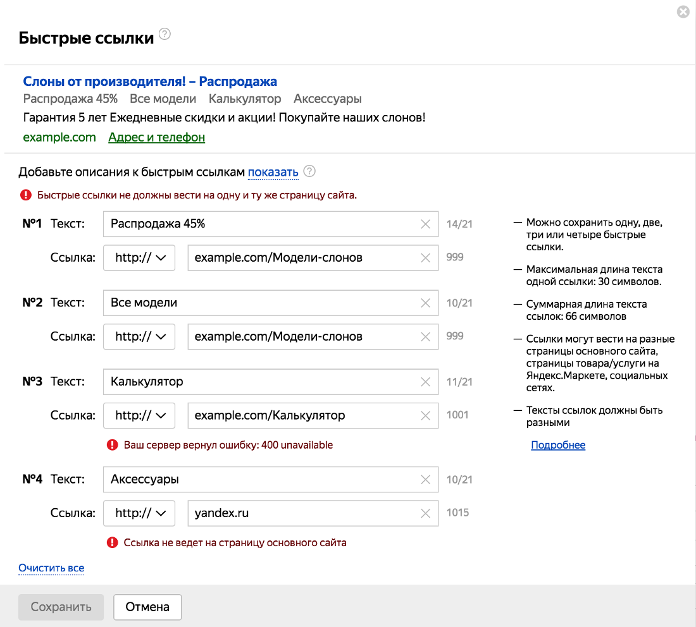

---

layout: yandex2

style: |
    /* собственные стили можно писать здесь!! */
    
    .xxx-image { margin: 0 auto;}
    .xxx-image-gr { border: 1px solid #ccc; margin: 30px auto;}
    .xxx-image-adv { width: 100%; }
    .xxx-image-phantom { width: 92%; margin: 60px auto 0; }
    .xxx-shout h2 { font-size: 103px!important;}

---

# {:.logo}

## {{ site.presentation.title }}<br />в Headless Chrome
{:.title}

### {{ site.presentation.service }}



{:.nda}


<div class="authors">

<p>{{ site.author.name }}</p>
<p>{{ site.author.position }}, Яндекс.Директ</p>



<p>{{ site.author2.name }}, {{ site.author2.position }}</p>


</div>

## О чем поговорим

- {:.next}специфика автотестов веб-интерфейса 
- {:.next}Selenium-тесты <b>vs</b> тесты в headless-браузерах
- {:.next}как скрестить Mocha и headless Chrome

## Почему мы пишем тесты?
{:.section}

## Директ - очень большой проект
{:.fullscreen}

{:.xxx-image}

## Пример объявления
{:.images}

{:.xxx-image-adv}

## Пример объявления
{:.images}

{:.xxx-image-adv}

## Настройки объявления
{:.fullscreen}

{:.xxx-image-gr}

## Пример объявления
{:.images}

{:.xxx-image-adv}

## Пример объявления
{:.images}

{:.xxx-image-adv}

## Заголовок будет скрыт
{:.fullscreen}


## ???
{:.blockquote}

### большой проект, часто меняется, пишем тесты, необохдимый рабочий инструмент

## Тестирование<br />веб-интерфейса
{:.section}

## Тесты для класса/функции

```js
describe('MyClass', () => {
  it('Метод myAction должен возвращать -1', () => {
      // подготовка
      let obj = new MyClass();
      
      // действие
      let result = obj.myAction();
      
      // проверка
      assert.equal(result, -1);
  });
});
```

## Тесты для веб-интерфейса

```js
describe('MyForm', () => {
  it('Должна быть ошибка, если форма не заполнена', () => {
      // подготовка
      let form = createForm();
      
      // действие
      form.submit();
      
      // проверка
      var errorMessage = form.querySelector('.errors');
      assert.equal(errorMessage.innerText, 'Заполните все поля');
  });
});
```

## ???
{:.blockquote}

### браузер - это программа с GUI

## Заголовок будет скрыт
{:.fullscreen}


## Selenium-тесты
{:.section}

## Заголовок будет скрыт
{:.fullscreen}


## Пример Selenium-теста
{:.fullscreen}

```js
describe('Test Suite', function(){

    it('Test Case', function(){

        // подготовка
        browser.url('https://yandex.ru');
        
        // действие
        browser.setValue('#input', 'Я.Субботник');
        browser.submitForm('#search-form');

        // проверка
        expect(browser.getTitle())
            .equals('Я.Субботник - Яндекс: нашлось 52 млн. результатов');
    })
});
```

## Достоинства


{:.image-right}

- <b>Общий API для всех браузеров<b>

## Достоинства


{:.image-right}

- Общий API для всех браузеров
- <b>Масштабируемость<b>
    
## Mocha + Selenium
{:.fullscreen}

    
    
## npm i [hermione](https://www.npmjs.com/package/hermione)<br/><br/>npm i [nightwatch](https://www.npmjs.com/package/nightwatch)
{:.shout}    

## Только<br/>интеграционные тесты!
{:.blockquote}

## Отличия модульных и интеграционных тестов
{:.fullscreen}


## Заголовок будет скрыт
{:.fullscreen}


## Тесты в headless браузерах
{:.section}

## Заголовок будет скрыт
{:.fullscreen}


## Заголовок будет скрыт
{:.fullscreen}


## Заголовок будет скрыт
{:.fullscreen}


## PhantomJS остановлен
{:.fullscreen}

{:.xxx-image-phantom}

## puppeteer
{:.fullscreen}


## Mocha + Selenium
{:.fullscreen}

    

## npm i [mocha-headless-chrome](https://www.npmjs.com/package/mocha-headless-chrome)
{:.shout .xxx-shout}

## DEMO
{:.section}

## Контакты 
{:.contacts}



<figure markdown="1">

### {{ site.author.name }}


{{ site.author.position }}


</figure>





<figure markdown="1">

### {{ site.author2.name }}


{{ site.author2.position }}


</figure>



<!-- разделитель контактов -->
-------

<!-- left -->
- {:.mail}dima117a@yandex-team.ru
- {:.github}dima117

<!-- right -->
- {:.skype}dima117a
- {:.telegram}dima117a

<!-- 
- {:.twitter}@author
- {:.facebook}author

- {:.mail}author@yandex-team.ru
- {:.phone}+7-999-888-7766
- {:.github}author
- {:.bitbucket}author
- {:.twitter}@author
- {:.telegram}author
- {:.skype}author
- {:.instagram}author
- {:.facebook}author
- {:.vk}@author
- {:.ok}@author

-->
